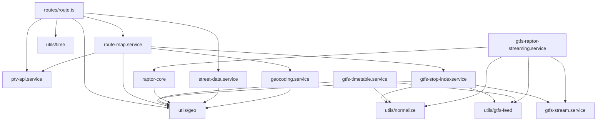

# NavMelb Backend — Architecture

## Overview

Express 5 + TypeScript service providing routing, GTFS timetable lookup, and geocoding for a Melbourne public transport navigation app. Architecture follows a layered model: HTTP routes → service layer → utilities.

## Module Table

| Module | Exports | Depth | Notes |
|--------|---------|-------|-------|
| `utils/geo.ts` | `distanceMeters` | Deep | Haversine formula. Single responsibility. |
| `utils/normalize.ts` | `normalizeName` | Deep | Stop name normalisation (lowercase, strip "station"/"railway"). |
| `utils/time.ts` | `addSecondsToTime` | Deep | HH:MM:SS arithmetic. |
| `utils/gtfs-feed.ts` | `getTransportType`, `resolveGtfsRoot` | Deep | Maps feed directory → transport type; resolves GTFS_ROOT env var. |
| `types/index.ts` | Pure type declarations | — | Shared contracts: `Coordinate`, `RouteSegment`, `RouteResult`, etc. |
| `services/geocoding.service.ts` | `geocodeAddress` | Deep | Cache + throttle + Nominatim call hidden behind one function. |
| `services/street-data.service.ts` | `loadStreetData`, `searchStreets`, `nearbyStreets` | Deep | In-memory street index hidden from callers. |
| `services/gtfs-stream.service.ts` | `streamStopTimesFromZip`, `streamFeedData`, + types | Moderate | Low-level GTFS zip streaming. `streamFeedData` materialises data into arrays (memory note). |
| `services/gtfs-stop-indexservice.ts` | `loadGtfsStops`, `loadRouteAssociations`, `findStopCoordinate`, `getAllStops`, `getStopsByType`, `findNearestStation`, `distanceMeters` (re-export) | Moderate | In-memory stop index keyed by normalised name. |
| `services/gtfs-timetable.service.ts` | `loadGtfsTimetables`, `loadGtfsShapes`, `getNextDepartureTime`, `findDeparturesForWaypoints`, `getTripBetweenStations`, `getShapeSegment`, + interfaces | Shallow | God module (743 lines). Three responsibilities: load, depart, shape. Raw maps previously leaked; now internal. |
| `services/raptor-core.ts` | `RaptorCore` class (5 public methods) | Deep | RAPTOR algorithm implementation. Data structures fully encapsulated. |
| `services/gtfs-raptor-streaming.service.ts` | `loadRaptorStreaming`, `isRaptorLoaded`, `queryRaptorJourney`, `getRaptorStats` | Moderate | Wraps `RaptorCore` with streaming GTFS load. |
| `services/ptv-api.service.ts` | 7 exports + 4 interfaces | Moderate | HMAC-signed PTV API calls. `ptvFindRouteBetweenStops` returns approximate durations (AVG_DWELL_SECONDS model). |
| `services/route-map.service.ts` | `lookupDestinationAny`, `osrmRoute`, `getPTVRoute` | Moderate | OSRM HTTP client with Haversine fallback; PTV route adapter. |
| `routes/route.ts` | 6 HTTP handler registrations | Shallow | Route handler contains inline orchestration logic (known debt — see roadmap). |

## Dependency Graph



## Data Flow: POST /route/calculate

```
Client
  └─→ routes/route.ts (validate, resolve departure time)
        ├─→ [car] osrmRoute → axios → OSRM server (fallback: distanceMeters)
        └─→ [ptv] for each station-to-station leg:
              getPTVRoute → ptvFindRouteBetweenStops → PTV API (HMAC-signed)
              for each other leg:
              osrmRoute → axios → OSRM server
        └─→ departure info: ptvFindStopByName + ptvGetDepartures → PTV API
```

## Known Architectural Debt

1. **`routes/route.ts` god handler** — The `POST /route/calculate` handler is ~170 lines of inline orchestration (departure time normalisation, leg classification, time accumulation, failure collection, departure info fetch). Should be extracted to `journey-orchestration.service.ts`. [L]

2. **`gtfs-timetable.service.ts` god module** — 743 lines across three responsibilities: loading, departure queries, shape extraction. Should split to `gtfs-timetable-loader.ts`, `gtfs-departure.service.ts`, `gtfs-shape.service.ts`. [L]

3. **Raw Map exports from `gtfs-stop-indexservice` and `gtfs-timetable.service`** — Several internal Maps are still exported directly (`stopIdToCoordinate`, `stopIdToTrips`, etc.), leaking storage layout to callers. Should be replaced with typed accessor functions. [M]

4. **`console.log` in service layer** — `ptv-api.service.ts` emits 15+ log lines including JSON-stringified API responses. Makes services untestable without output capture. Should route through a logger sink. [M]

## Utils Layer (post-refactor)

```
src/utils/
├── geo.ts          — distanceMeters (Haversine)
├── normalize.ts    — normalizeName (stop name normalisation)
├── time.ts         — addSecondsToTime (HH:MM:SS arithmetic)
└── gtfs-feed.ts    — getTransportType, resolveGtfsRoot
```

All four utilities are pure functions with no side effects and no module-level state.

## Test Structure

```
src/__tests__/
├── acceptance/          — HTTP integration tests (supertest + vitest)
│   ├── health.test.ts
│   ├── station-search.test.ts
│   ├── route-calculate.test.ts
│   ├── destination-lookup.test.ts
│   ├── distance.test.ts
│   └── streets.test.ts
├── architecture/        — Contract tests for public module interfaces
│   ├── utils-normalize.contract.test.ts
│   ├── utils-time.contract.test.ts
│   ├── utils-gtfs-feed.contract.test.ts
│   ├── route-map-service.contract.test.ts
│   ├── geocoding-service.contract.test.ts
│   └── street-data-service.contract.test.ts
├── services/            — Unit tests for service logic
│   ├── geocoding.test.ts
│   ├── gtfs-stops.test.ts
│   ├── gtfs-timetable.test.ts
│   └── haversine.test.ts
├── fixtures/            — Minimal GTFS zip fixtures + street GeoJSON
└── helpers/
    └── create-app.ts    — Test app factory (loads fixtures)
```
